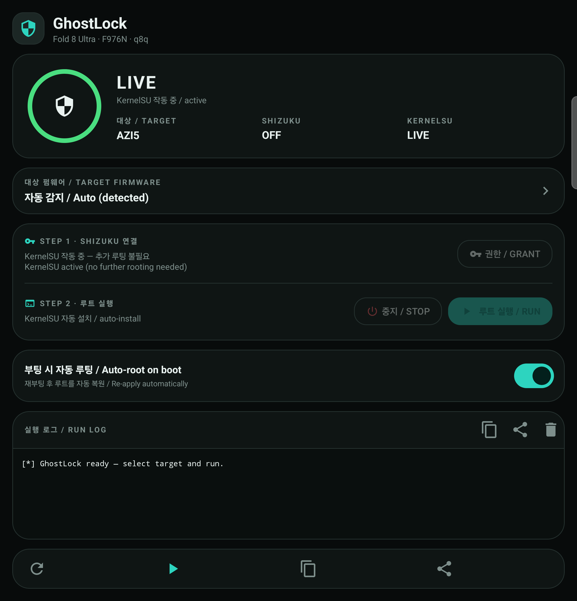

# Fold8-Ultra-Root-F976N

<p align="right">
  <b>한국어</b> · <a href="README.en.md">English</a>
</p>

<p align="center">
  
</p>

<p align="center">
  삼성 갤럭시 Z 폴드8 울트라(<b>SM-F976N</b>, 코드명 <b>q8q</b>)용 <b>원클릭 KernelSU</b> 설치 도구입니다.<br>
  <b>CVE-2026-43499</b> late-load 익스플로잇을 <b>Shizuku</b>로 실행합니다.
</p>

<p align="center">
  <a href="../../releases/latest">최신 APK 다운로드</a>
</p>

> ## ⚠️ 경고
> **I am not responsible for bricked phones. — 벽돌된 폰에 대해 책임지지 않습니다.**
> - 이 도구는 파티션을 플래시하지 않는 **임시 루트(late-load)** 방식이라 KNOX 워런티 비트를 트립하지 않습니다.
> - 다만 펌웨어가 맞지 않거나 실행이 잘못되면 **부팅 불가(벽돌)** 가 될 수 있습니다.
>   **반드시 본인 소유 기기**에서만, 아래 지원 펌웨어에서만 실행하세요.
> - 루트가 활성화된 동안 일부 앱(금융·정부·DRM 등)은 루트를 감지해 실행을 거부할 수 있습니다(재부팅 시 해제).
> - 무보증. 사용에 따른 모든 책임은 사용자에게 있습니다.

---

## 스크린샷

<p align="center">
  
</p>

---

## 지원 펌웨어

| 리비전 | PDA | 익스플로잇 페이로드 | ksud |
|---|---|---|---|
| rev1 | `F976NKSU1AZGI` | `preload.so` | `ksud` |
| rev2 | `F976NKSS2AZH7` | `preload-azh7.so` | `ksud-azh7` |
| rev3 | `F976NKSU3AZI5` | `preload-azi5.so` | `ksud-azi5` |

앱이 `Build.FINGERPRINT` / `Build.DISPLAY` / `Build.ID` 로 실행 중인 펌웨어를 자동 감지해 알맞은
페이로드를 고릅니다. **TARGET FIRMWARE** 카드에서 수동 선택도 가능합니다.

## 요구사항

- 지원 펌웨어가 설치된 갤럭시 Z 폴드8 울트라 **SM-F976N (q8q)**
- **[Shizuku](https://github.com/RikkaApps/Shizuku)** 설치 및 실행 (무선 디버깅 / adb 모드면 충분)
- **[KernelSU 매니저](https://github.com/tiann/KernelSU/releases) 앱** — 이 앱에 **포함되어 있지 않으므로 별도로 설치**해야 합니다
  (테스트 환경: v3.3.0). 모듈 로드 후 루트를 사용하려면 필요합니다.
- 이 앱은 파티션을 플래시/수정하지 않고 런타임에 KernelSU 모듈을 로드합니다.
  따라서 재부팅 후 루트를 다시 적용해야 합니다(자동 루팅을 켜면 자동).

## 사용법

1. **[KernelSU 매니저](https://github.com/tiann/KernelSU/releases)** 앱을 먼저 설치합니다 (이 앱에는 포함되어 있지 않습니다).
2. [Releases](../../releases/latest) 에서 이 앱의 APK 설치
3. **Shizuku** 실행(무선 디버깅 페어링) 후 이 앱 열기
4. **GRANT PERMISSION** 탭 → Shizuku 권한 승인. 링이 `READY` 로 바뀝니다.
5. **RUN EXPLOIT** 탭. 로그가 표시되고, 성공하면 링이 `LIVE`(KernelSU 작동 중) 로 바뀝니다.
6. **KernelSU 매니저**를 열어 앱에 루트를 부여하세요.

### 부팅 자동 루팅

**Auto-root on boot** 를 켜면 재부팅 후 포그라운드 서비스가 Shizuku를 최대 5분 대기한 뒤
부팅당 1회 루트를 다시 적용합니다. KernelSU가 이미 로드돼 있으면 **재실행하지 않고 건너뜁니다.**

### 참고 및 제한

- 시도당 최대 3회 재시도(60초 간격), 시도당 logcat 감시 60초, 재부팅 감지 시 중단됩니다.
- 이 ROM에서 무권한 앱은 `/proc/modules` 를 읽을 수 없어, KernelSU 감지는 Shizuku 경유
  (또는 KernelSU에서 이 앱에 루트를 부여한 경우 `su`) 로 동작합니다. Shizuku가 없으면 `LIVE` 판정이 불가합니다.
- 한 번에 하나만 실행하세요(전역 실행 락).

## 추가 정보

- **안정성**: S25 계열 임시루트보다 성공률이 높은 편입니다. 보통 1~3회 안에 성공합니다.
  가끔 루트 몇 분 뒤에 재부팅되는 경우가 있는데, 그때 다시 실행하면 됩니다.
- **LSPosed 사용 시**: 아래 조합을 권장합니다.
  - [NeoZygisk-PostBoot](https://github.com/igorcv88/NeoZygisk-PostBoot) 2.3+
  - [LSPosed](http://lsposed.zip/) 2.2.0
- **금융/주식 앱 루트 숨기기**: [HMA-OSS](https://github.com/frknkrc44/HMA-OSS/releases) 권장.

## 빌드

요구사항: **JDK 17**, **Android SDK 34** (NDK 불필요 — 페이로드는 미리 빌드된 asset 입니다).

```sh
JAVA_HOME=/path/to/jdk-17 ./gradlew :app:assembleRelease
# 출력: app/build/outputs/apk/release/app-release.apk
```

`local.properties` 와 서명 키는 의도적으로 **커밋하지 않습니다.** 릴리즈 빌드를 하려면 `sdk.dir` 을
본인 SDK로 지정하고, 본인 키를 만들거나 debug 서명을 사용하세요.
배포된 APK는 AOSP **testkey**(`alias testkey`, 비밀번호 `android`) 로 서명되어, 기존 testkey 서명
빌드 위에 그대로 덮어쓰기 설치됩니다.

### 번들 자산 무결성 (SHA-256)

| 자산 | SHA-256 (앞자리) |
|---|---|
| `preload.so` | `947099db3862efcc…` |
| `preload-azh7.so` | `0408d45a1ba33701…` |
| `preload-azi5.so` | `db1b56b942ff03e6…` |
| `ksud` | `c4830698accaa951…` |
| `ksud-azh7` | `b140d354cffed359…` |
| `ksud-azi5` | `784e4ea7ddee2f8c…` |

## 크레딧

이 프로젝트는 다음 오픈소스 없이는 존재할 수 없습니다.

- [YuKongA/ghostlock-app](https://github.com/YuKongA/ghostlock-app) — GhostLock 앱 (UI/로직 기반, Apache-2.0)
- [diabl0w/ghostlock-q8q](https://github.com/diabl0w/ghostlock-q8q) — q8q 익스플로잇 페이로드
- [NebuSec/CyberMeowfia](https://github.com/NebuSec/CyberMeowfia) · [polygraphene/CyberMeowfia](https://github.com/polygraphene/CyberMeowfia) — CVE-2026-43499 원 리서치
- [tiann/KernelSU](https://github.com/tiann/KernelSU) — KernelSU (GPL-3.0)
- [RikkaApps/Shizuku](https://github.com/RikkaApps/Shizuku) — Shizuku (Apache-2.0)
- [BuSung-dev/Root-My-Galaxy](https://github.com/BuSung-dev/Root-My-Galaxy) — 프로젝트 구조/릴리즈 참고
- [kuuky29/UniRoot](https://github.com/kuuky29/UniRoot) — 부팅 자동 루팅(auto-root on boot) 기능 참고

자세한 내용은 [NOTICE](NOTICE) 참고.

## 라이선스

**Apache License 2.0** 으로 배포됩니다. [LICENSE](LICENSE) 참고.

번들된 `ksud` 바이너리와 KernelSU 커널 모듈은 **GPL-3.0** 을 따릅니다([NOTICE](NOTICE) 참고).
